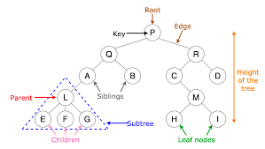

이진 탐색
=
**순차 탐색(Sequential Search)** : 리스트 안에 있는 특정한 데이터를 찾기 위해 앞에서부터 데이터를 하나씩 확인하는 탐색법. 주로 정렬이 되지 않는 리스트에서 데이터를 찾아야 할 때 사용. 시간만 충분하면 원하는 데이터를 찾을 수 있음.
> 1. 찾고자 하는 데이터를 정한다.
> 2. 첫 번째 데이터를 찾고자 하는 데이터와 비교한다.
> 3. 두 번째, 세 번째 데이터 이런식으로 찾고자 하는 데이터가 나올 때 까지 순차로 실행한다.
> 4. 원하는 데이터를 탐색했을 때 실행 종료

리스트 자료형에서 특정한 값을 가지는 원소의 개수를 세는 count() 메서드를 이용할 때도 내부에서는 순차 탐색이 수행된다.
~~~python
for sequential_search(n, targer, array):
    for i in raneg(n):
        if array[i] == target:
            return i + 1

print("생성할 원소의 개수를 입력한 다음 한 칸 띄고 찾을 문자열을 입력하세요.")
input_data = input().split()
n = int(input_data[0])
target = input_data[1]

print("앞서 적은 원소 개수만큼 문자열을 입력하세요. 구분은 띄어쓰기 한 칸으로 합니다. ")
array = input().split()

print(sequential_search(n, target, array))
~~~
순차탐색의 시간복잡도는 O(N) 이다.

## 이진 탐색
**이진 탐색** : 배열 내부의 데이터가 정렬된 상태에서 사용되는 알고리즘으로 탐색 범위를 절반씩 좁혀가며 탐색한다.
이진 탐색은 변수 3개를 사용해 시작점, 끝점, 중간점을 나눠서 탐색을 이어나간다.
> **이진 탐색의 탐색 과정**   
> 1. 시작점, 끝점, 중간점을 변수로 지정한다.
> 2. 탐색 하고자 하는 수와 중간점의 데이터를 비교하는데 중간점이 더 크면 탐색 범위를 중간점보다 더 큰 데이터들로 바꾸고 작으면 더 작은 데이터들로 바꾼다.
> 3. 바꾼 범위에서 1, 2번 과정을 반복하고, 탐색하고자 하는 데이터와 중간점이 같아지면 탐색을 종료한다.

이진 탐색의 시간 복잡도는 O(log(2)N) 이다.
- 다음은 재귀 함수로 구현한 이진 탐색 코드이다.
~~~python
def binary(array, target, start, end):
    if start > end:
        return None
    mid = (start + end) // 2
    
    if array[mid] == target:
        return mid
    elif array[mid] > target:
        return binary(array, target, start, mid - 1)
    else:
        return binary(array, target, start, mid + 1)

n, target = list(map(int, input().split()))
array = list(map(int, input().split()))

result = binary(array, target, 0, n-1)
if result == None:
    print("원소가 존자하지 않습니다.")
else:
    print(result + 1)
~~~
- 다음은 반복문으로 구현한 이진 탐색 코드이다.
~~~python
def binary(array, target, start, end):
    while start <= end:
        mid = (start + end) // 2
    if array[mid] == target:
        return mid
    elif array[mid] > target:
        end = mid - 1
    else:
        start = mid + 1
    return None

n, target = list(map(int, input().split()))
array = list(map(int, input().split()))

result = binary(array, target, 0, n-1)
if result == None:
    print("원소가 존자하지 않습니다.")
else:
    print(result + 1)
~~~

## 트리 자료구조

- 트리는 부모 노드와 자식 노드의 관계로 표현된다.
- 트리의 최상단 노드를 루트 노드라고 한다.
- 트리의 최하단 노드를 단말 노드라고 한다.
- 트리에서 일부를 떼어내도 트리 구조이며 이를 서브 트리라 한다.
- 트리는 파일 시스템과 같이 계층적이고 정렬된 데이터를 다루기에 적합하다.

**이진 탐색 트리**
트리 자료구조 중에서 가장 간단한 형태로 위 이진 탐색을 가장 쉽게 접할 수 있는 자료구조 중 하나다.

---
별도로 이번 장에서는 입력을 빠르게 받는 코드를 알려준다.
~~~python
import sys

input_data = sys.stdin.readline().rstrip()

print(input_data)
~~~
readline() 함수를 통해 시관 초과를 피할 수 있는 경우도 있고,
sys 라이브러리를 사용할 때는 한 줄 입력받고 나서 rstrip() 함수를 꼭 호출해야한다.
readline() 함수는 엔터를 줄 바꿈 기호로 인식하는데 이 공백 문자를 제거하기 위해서 이다.

